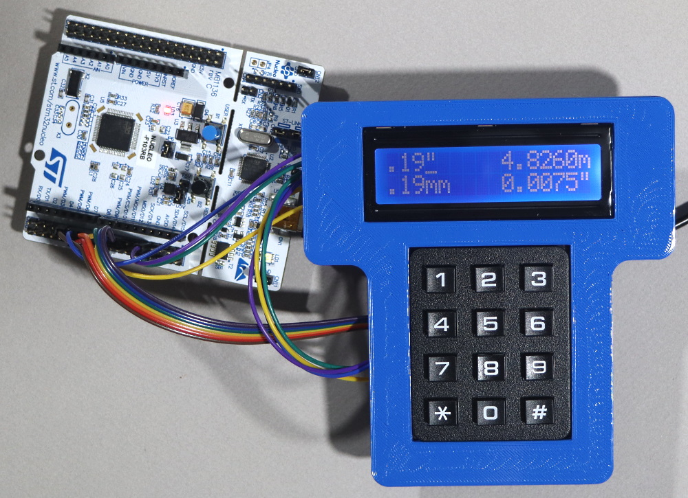

# Matrix Keypad Driver



Provides an embedded Rust driver for a common numeric matrix keypad.

## Example

```rust
let rows = (
    gpiob.pb15.into_pull_up_input(&mut gpiob.crh),
    gpioa.pa7.into_pull_up_input(&mut gpioa.crl),
    gpiob.pb6.into_pull_up_input(&mut gpiob.crl),
    gpioa.pa9.into_pull_up_input(&mut gpioa.crh),
);

let cols = (
    gpioa.pa8.into_open_drain_output(&mut gpioa.crh),
    gpiob.pb5.into_open_drain_output(&mut gpiob.crl),
    gpioc.pc7.into_open_drain_output(&mut gpioc.crl),
);

let mut keypad = Keypad::new(rows, cols);

let key = keypad.read_char(&mut delay);
if key != ' ' {
    ...
}
```